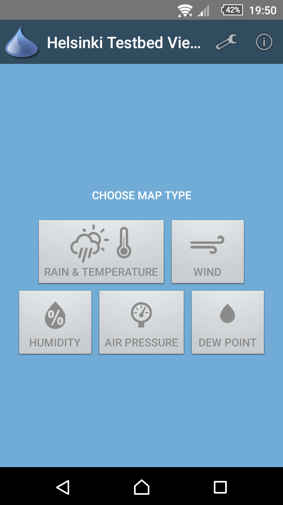
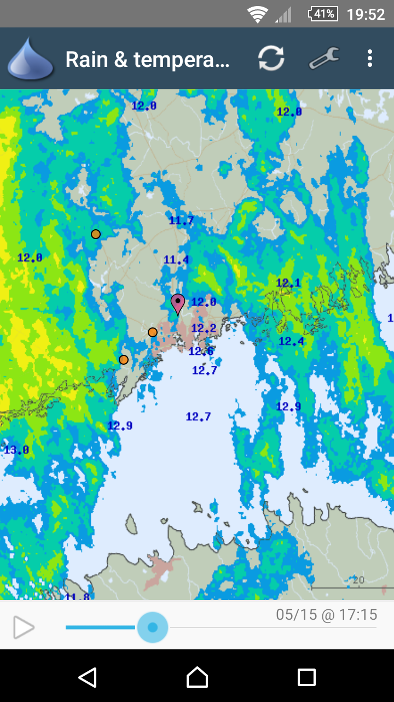
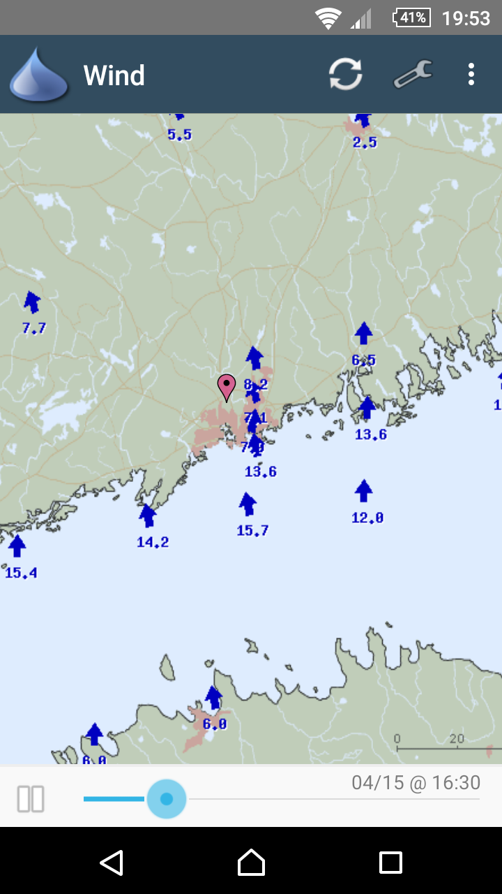
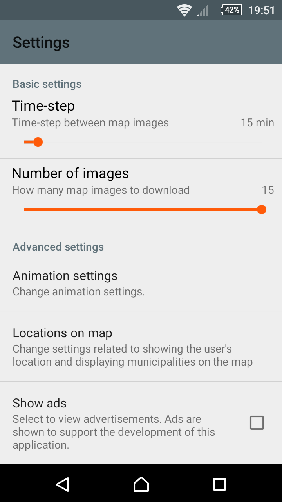

Helsinki Testbed Viewer 2.0
=============

__Helsinki Testbed Viewer 2.0__ is an Android application which shows the weather maps
from the [Helsinki Testbed project](http://testbed.fmi.fi/). With the application,
you can, for example, view the real-time rain radar or current wind speed and direction.
The maps cover the Southern Finland.

   

The Helsinki Testbed project is owned by the
[Finnish Meteorological Institute](http://ilmatieteenlaitos.fi/). __The Helsinki Testbed Viewer 2.0
application HAS NOTHING TO DO WITH the Helsinki Testbed project or the Finnish Meteorological Institute__.
This application is a private project and it just downloads the weather maps from
the Helsinki Testbed project websites and shows the maps on Android phones.
All map data is copyrighted to the Helsinki Testbed project.
Location data (user and municipalities) DOES NOT come from the Helsinki Testbed Project.

The application supports displaying the following weather maps:
 * Rain & temperature
 * Wind speed & direction
 * Humidity
 * Air pressure
 * Dew point

The application also supports displaying the user's current location (coarse location based
on the Cellular network) and the selected municipalities on top of the map.

Download
-------

The latest stable version of this application can be downloaded to an Android phone
from [the application website in Google Play](https://play.google.com/store/apps/details?id=fi.testbed2).

Previous versions and original author
-------

Helsinki Testbed Viewer 2.0 is originally based on the GPL licensed sources from the
[Helsinki Testbed Weather View](https://play.google.com/store/apps/details?id=fi.asd.testbed)
android application __originally developed by Petri Laakso (petri+testbed@asd.fi)__.
The original version is currently not working anymore. Therefore, this project was created to continue the work.

License
-------

Helsinki Testbed Viewer 2.0 is a completely free and open project. The source code is
licensed as GNU GENERAL PUBLIC LICENSE Version 3. See more from the LICENSE file.

All map data is copyrighted to the Helsinki Testbed project.

Homepage
-------

See http://mvestola.github.io/helsinki-testbed2-android/
